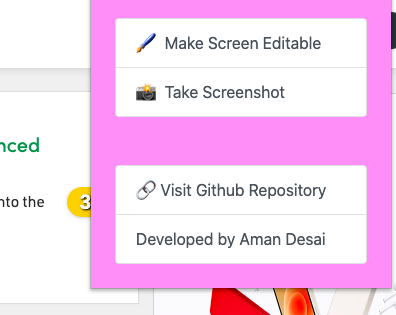

<br />
<p align="center">
  <a href="https://github.com/amandesai01/EditShot">
    
  </a>

  <h1 align="center">EditShot</h1>

  <p align="center">
    A tool which makes Editing a WebPage and then Saving it as Image. Easy-Peasy!
    <br />
    <a href="https://github.com/amandesai01/EditShot/issues">Report Bug</a>
    ·
    <a href="https://github.com/amandesai01/EditShot/issues">Request Feature</a>
  </p>
</p>

## Description

Suppose you want to edit a MarkSheet before taking a screenshot, or just want a tool to make a prank, or you want to make a meme. All these requires taking a screenshot and then editing it. If someone is tech savy, he/she may use inspect element. Well, this tool makes this process easier.

Here's how:
* Once you hit "Make Screen Editable", it grabs all the elements in the DOM and sets their `contenteditable` property yo `true`. 
* Then, it iterates over all the links and deletes their `href` propery. Thus, saving user from getting redirected while editing. :wink:
* Lastly, when user hits the `Take Screenshot` button, it uses `html2canvas` library to generate a image. It is in memory currently.
* Then, it creates an "in-memory" `a` tag, appends the data to the URL by doing some conversions and hits that a tag.
* Ofcourse everything is done behind the scenes and quickly. So this dosen't hamper the experience. :smile:


```
This extension is UNDER REVIEW and once done,
it will be available for download from chrome webstore. Link will be updated instead of this box once verification is done.

Till then, STAR THIS REPO ;)
```

## DEMO:


## Screenshot:


---

This Project Was Made within 2hrs as a fun weekend activity. XD